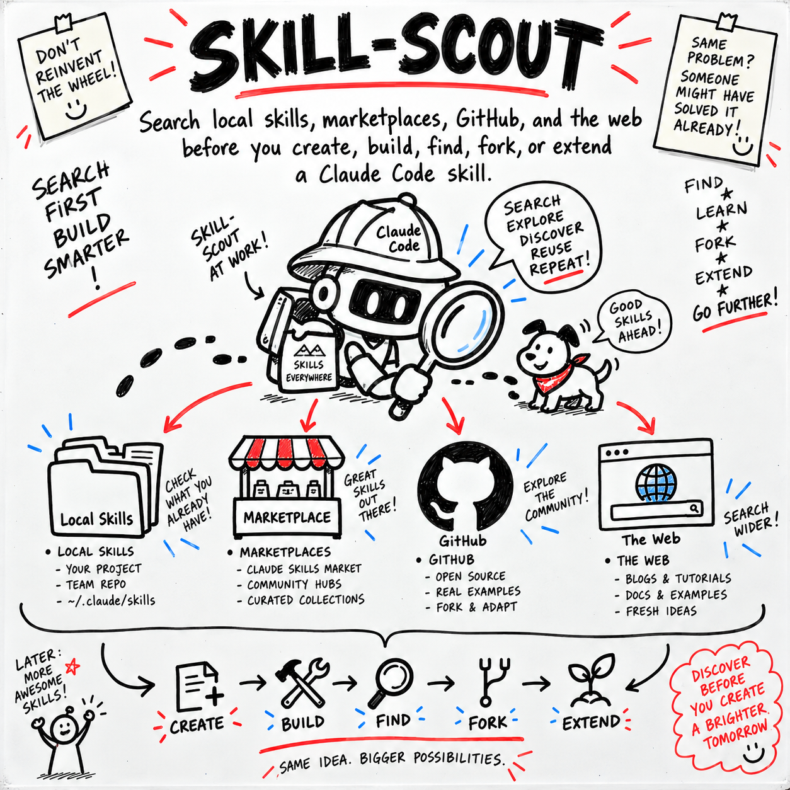

# skill-scout-plus



   

> **Built on [affaan-m/ECC](https://github.com/affaan-m/ECC)** by @affaan-m (263,318 stars, MIT). All credit for the original idea to them. This fork improves and repackages it; upstream license preserved in [UPSTREAM_LICENSE](UPSTREAM_LICENSE).

**Find and check the best existing Claude Code skill before you build, fork, or install one.**

Made for Claude Code users who want to reuse good work without trusting unknown code too soon.

## 🔎 Why

A useful skill may already exist on your computer or online.

Finding it can take more time than making a new one.

Outside skills may hide unsafe commands, broad access, or unclear license terms.

Skill Scout searches in a clear order. It checks each close match before it suggests what to do next.

It fits into your current Claude Code flow. The skill is one file and has no extra packages.

## ⚡ Install

Run one command:

```bash
mkdir -p ~/.claude/skills/skill-scout && curl -fsSL https://raw.githubusercontent.com/skill-scout-plus/skill-scout-plus/main/skill/SKILL.md -o ~/.claude/skills/skill-scout/SKILL.md
```

## 🧭 Usage

Ask Claude Code:

```text
Make a skill that writes release notes from merged pull requests.
```

Skill Scout will define the need, search local sources, and search GitHub or the web when those tools are available. It will read close matches before ranking them.

Expected output:

```text
I found two close local skills and one outside skill. article-writing
is the best fit, but it has no pull request checklist.

Choose one:
1. Use it
2. Fork it
3. Make a new skill
```

It will not install, fork, or create a skill until you choose a path, unless you already chose one or no close match exists.

## 🛠️ What we changed vs upstream

- The full text was rewritten from Japanese into simpler, more direct English. Credit to the original author is now easy to see.
- The use rules now include finding the closest skill. They also say to split unrelated tasks so each skill has a clear scope.
- Local and remote search steps now cover escaped search words, missing folders, too many results, no results, and use of only the tools already available.
- Checks for outside skills are much stronger. They cover linked files, licenses, access needs, hidden downloads, and harmful actions. Outside code must not run during review.
- Ranking now puts safety and task fit first. The supplied improved version ends at “Re,” so its later decision table, examples, bad patterns, and related items could not be checked against the original.

## 📄 License

This project uses the MIT License.

The upstream MIT license and credit are preserved in [UPSTREAM_LICENSE](UPSTREAM_LICENSE).